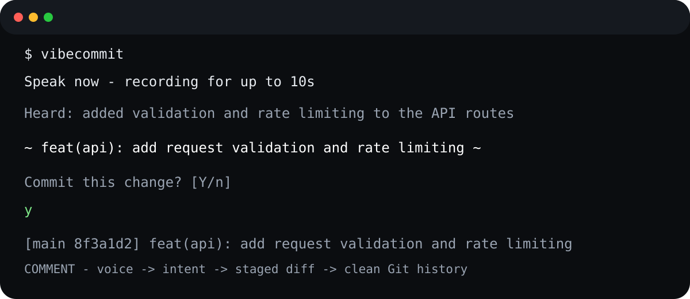

# COMMENT — VibeCommit

**Say what you changed. COMMENT writes the Git commit.**

[](https://github.com/artclass11/COMMENT/actions/workflows/ci.yml) [](LICENSE) [](https://www.python.org/)



**Voice → staged diff → Conventional Commit.**

VibeCommit is a small, open-source CLI that records up to 10 seconds from your default microphone, transcribes it locally with Whisper, reads `git diff --staged`, sends only the transcript + staged diff to an OpenAI-compatible LLM endpoint, and proposes one Conventional Commit subject line.

```text
$ vibecommit

🎙  Speak now — recording for up to 10s
🧠 Transcribing locally with Whisper (base)...
📝 Heard: added validation and rate limiting to the API routes

  ~  feat(api): add request validation and rate limiting  ~

Commit this change? [Y/n] y
```

## Why COMMENT?

Traditional commit helpers infer intent from code alone. COMMENT adds a human voice note without turning that note into an unchecked commit: the staged diff remains the source of truth, the generated subject is validated, and the actual commit requires confirmation.

## Features

- One-file application: `VibeCommit.py`
- Local Whisper transcription; raw microphone audio is deleted after transcription
- OpenAI-compatible LLM endpoint support (Ollama, OpenAI-compatible gateways, self-hosted models, etc.)
- Reads only staged changes with `git diff --staged`
- No shell interpolation for Git commands
- Diff-size guard to limit accidental prompt/data leakage
- Strict Conventional Commit validation
- Interactive `[Y/n]` commit confirmation
- `--dry-run` mode
- Configurable recording time, Whisper model, LLM URL/model, timeout, and diff limit

## Requirements

- Python 3.10+
- Git
- A working microphone
- A local Whisper installation or a Python environment able to install `openai-whisper`
- FFmpeg available on PATH (required by Whisper)
- An OpenAI-compatible chat-completions endpoint

### Linux / macOS dependency note

On Linux, `sounddevice` may require PortAudio development/runtime packages. Whisper also requires FFmpeg. For Debian/Ubuntu:

```bash
sudo apt-get update
sudo apt-get install -y portaudio19-dev ffmpeg
```

On macOS, install FFmpeg with Homebrew (`brew install ffmpeg`). On Windows, install FFmpeg and ensure `ffmpeg.exe` is on `PATH`; also check Windows microphone permissions and the default input device.

## Install

### Fastest install from GitHub

```bash
python -m pip install git+https://github.com/artclass11/COMMENT.git
vibecommit --version
```

```bash
git clone <your-github-url>/COMMENT.git
cd COMMENT
python -m venv .venv

# macOS/Linux
source .venv/bin/activate

# Windows PowerShell
# .venv\\Scripts\\Activate.ps1

python -m pip install --upgrade pip
pip install -r requirements.txt
```

Whisper downloads its selected model on first use. `base` is a practical multilingual default; change it with `--whisper-model`.

## Configure the LLM

VibeCommit expects an OpenAI-compatible `POST /chat/completions` endpoint.

### Ollama (local, no cloud key)

Install Ollama and pull a chat model, then:

```bash
ollama pull llama3.2:3b
```

VibeCommit defaults to:

```text
URL:   http://localhost:11434/v1/chat/completions
MODEL: llama3.2:3b
```

### OpenAI-compatible cloud endpoint

Set environment variables instead of putting secrets in shell history or source code:

```bash
# macOS/Linux
export VIBECOMMIT_LLM_URL="https://your-provider.example/v1/chat/completions"
export VIBECOMMIT_LLM_MODEL="your-model"
export VIBECOMMIT_LLM_API_KEY="your-secret"

# Windows PowerShell
$env:VIBECOMMIT_LLM_URL="https://your-provider.example/v1/chat/completions"
$env:VIBECOMMIT_LLM_MODEL="your-model"
$env:VIBECOMMIT_LLM_API_KEY="your-secret"
```

## Usage

### No microphone? Use typed intent

```bash
vibecommit --text "add request validation and rate limiting" --dry-run
```

The typed path keeps the same staged-diff + LLM workflow and makes COMMENT usable on CI runners, servers, accessibility setups, and quick demos.

Stage your changes first:

```bash
git add src/ README.md
vibecommit
```

Useful options:

```bash
vibecommit --seconds 6
vibecommit --whisper-model tiny.en
vibecommit --max-diff-chars 12000
vibecommit --dry-run
```

## Data and security model

- The WAV file is created in the system temporary directory and deleted in `finally` after execution.
- With local Whisper, the raw audio is processed locally by this program.
- The staged diff and transcript are sent to the configured LLM endpoint. Review that provider's data-retention/privacy terms.
- API keys are read only from environment variables (`VIBECOMMIT_LLM_API_KEY`, or `OPENAI_API_KEY` as a fallback); they are never accepted as CLI arguments.
- Git commands are invoked as argument arrays, not through a shell.
- Only staged changes are used for the commit message.

Do not stage secrets. A staged diff can contain credentials, tokens, proprietary code, or other sensitive material.

## Troubleshooting

**No microphone / PortAudio error**

Check your OS input permissions and available audio devices. You can inspect devices in Python with:

```bash
python -c "import sounddevice as sd; print(sd.query_devices())"
```

**Whisper install fails**

`openai-whisper` depends on PyTorch and can be heavy. Use a compatible Python/PyTorch environment, then reinstall the requirements.

**LLM response rejected**

The endpoint must return an OpenAI-compatible payload containing:

```json
{
  "choices": [
    {"message": {"content": "feat(api): add request validation"}}
  ]
}
```

## Open-source license

MIT. See `LICENSE`.

## Release validation

The 1.1.0 release includes automated tests for commit validation, staged-diff handling, OpenAI-compatible LLM responses, audio cleanup, and core parsing.

Run the test suite locally:

```bash
python -m unittest discover -s tests -v
python -m py_compile VibeCommit.py
```

The project also runs these checks in GitHub Actions on supported pushes and pull requests.